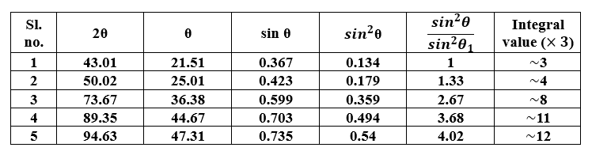
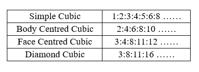

In the diffractogram given in <b>Figure 2</b> for an unknown material, the following procedure is adhered:   

<b>Steps :</b>  

1. Firstly, the 2θ values where diffraction occurred are obtained,   
2. Subsequently, the corresponding θ, sin θ and sin2θ values for all the peaks are noted,  
3. The ratios of sin2θ value of all the peaks with respect to the first peak is obtained,  
4. Finally, the obtained ratios are multiplied by a suitable integer to convert all these ratios into an integer.   

  

5. The distinction between lattices of the cubic system is possible by using the fact that not all combinations of h2+k2+l2 lead to reflection for a given lattice. The ratio of h2+k2+l2 values for allowed reflections from different crystals are as follows [3]:   

 

<b>It is clear from the above table that the unknown material whose diffractogram is given is an FCC material.</b> 

