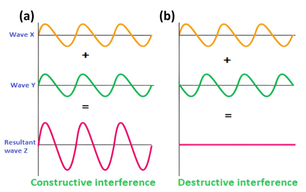
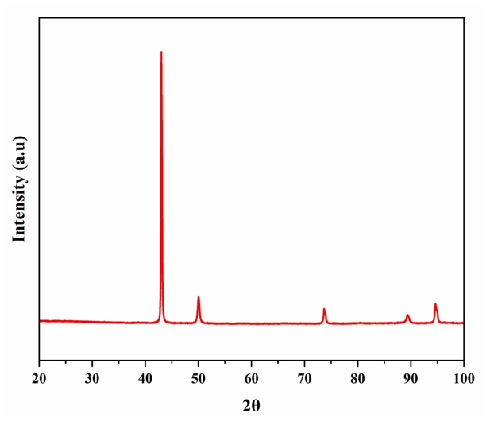

1.	<b>X-ray Wavelengths</b>: X-rays used for diffraction typically have wavelengths from 0.05 to 0.25 nm. This range is ideal because it is on the same order of magnitude as the spacing between planes of atoms in a crystal.  

2.	<b>Production of X-rays</b>: X-rays are produced in an X-ray tube, where a high voltage is applied between a cathode and an anode (the target metal). When electrons from the cathode strike the target metal, X-rays are emitted. The choice of target metal determines the characteristic wavelength of the X-rays.  

3.	<b>Diffraction and Crystal Planes</b>: When a monochromatic X-ray beam with wavelength (λ) strikes at an angle where the wave patterns emerging from different atomic planes are in phase, the beams reinforce one another, leading to constructive interference (Figure 1(a)). On the other hand, if the reflected waves are out of phase, no reinforced beam is formed, a process known as destructive interference (Figure 1(b)).  

For crystals, the produced X-rays are directed at a crystalline solid, the waves can be scattered by the planes of atoms within the crystal. Due to the regular spacing of these atomic planes, the scattered X-rays can interfere constructively or destructively, depending on their phase differences.  

 
Figure 1: (a) Constructive and (b) destructive interference   

4.	<b>Diffraction Peaks</b>: Constructive interference of the scattered X-rays leads to diffraction peaks observed at specific angles. The intensities and positions of these peaks provide information about the crystal structure, such as the arrangement and spacing of atoms. 
Crystal structure determination of an unknown powder using XRD is one of its many applications. The following method is crucial for determining the atomic structure of materials and identifying unknown crystalline substances. For cubic crystals, interplanar spacing d, can be written as a function of the miller indices and lattice parameter a, using the following relation:  

 

For first-order diffraction, n=1 and monochromatic beam source λ and lattice parameter a of a material is constant; therefore, the sum of the squares of the miller indices of a plane will be in proportion to the sin2 θ values [2].  

 
Figure 2: Diffractogram for an unknown material   

